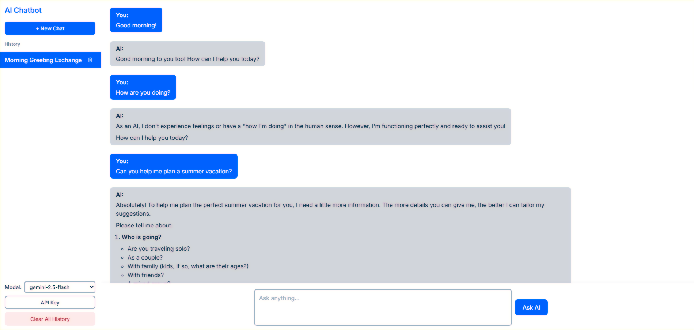

# AI Chatbot Application

This is an AI chatbot interface built with Angular. It allows users to interact with Google's powerful Gemini large language models in a persistent, multi-conversation format.



## Features

-   **Real-time AI chat:** Engage in conversations with the Gemini API.
-   **Markdown and LaTeX rendering:** AI responses are beautifully rendered, supporting code blocks, lists, mathematical formulas, and more.
-   **Full conversation history:** All conversations are automatically saved to your browser's local storage for persistence.
-   **Multi-conversation management:** Easily switch between different chats, each with an AI-generated title for quick reference.
-   **Model selection:** Choose from a list of available Gemini models to experiment with different AI capabilities.
-   **Secure API key management:** Your API key is stored securely in your browser and managed through an in-app modal.
-   **Robust UI:** Includes clear loading states, error handling, and confirmation popups for a smooth and intuitive user experience.

## Tech Stack

-   **Framework:** Angular
-   **Language:** TypeScript
-   **API:** Google Gemini
-   **Markdown parsing:** marked
-   **LaTeX rendering:** KaTeX

---

## Getting Your Google Gemini API Key

1. Open your web browser and navigate to [https://console.cloud.google.com/projectcreate](https://console.cloud.google.com/projectcreate) (log in with your Google account if prompted).

2. Under the "Project name" input field, give your project any name, and click on the "Create" button.

3. Go to [https://aistudio.google.com/apikey](https://aistudio.google.com/apikey) and log in with your Google account if prompted.

4. Click on "Get API key"

5. Click on the blue **"+ Create API key"** button near the top right corner of the page.

6. Click on the "Search Google Cloud projects" input field and in the dropdown menu, select the Google Cloud project you created in step 2.

7. Click on the blue **"Create API key in existing project"** button, copy the generated API key (it is a long string of random letters and numbers), and save it somewhere safe for the next section (like a temporary text file).

---

## Running the Application Locally

### 1. Prerequisites

Before you begin, ensure you have the following software installed on your machine:
*   **Node.js and npm:** This is the runtime environment for the project. You can download it from [nodejs.org/en/download](https://nodejs.org/en/download) (`npm` is included with Node.js).
*   **Angular CLI:** This is a command-line tool for managing Angular projects. You can install it globally by running the following command in your terminal:
    ```bash
    npm install -g @angular/cli
    ```

### 2. Installation & Setup

1.  Open your terminal or command prompt and clone this project to your local machine using the command below:
    ```bash
    git clone <your-repository-url>
    ```

2.  Navigate to the project directory using the command below:
    ```bash
    cd ai-chatbot
    ```

3.  Install all the necessary libraries for the project to run by running the following command:
    ```bash
    npm install
    ```

### 3. Running the App

1. Run the following command to build the application and start a local web server.
    ```bash
    ng serve
    ```
    Wait for the terminal to indicate that the compilation is complete.

2. Open your web browser and navigate to the address provided by the **"ng serve"** command (typically `http://localhost:4200/`).

### 4. Setting Your API Key

1.  When you first open the app, a popup will appear asking for your API key (if this popup does not appear, click on the "API Key" button near the bottom left corner of the page to see the popup).
2.  Paste the key you saved from the "Getting Your Google Gemini API Key" section into the input field.
3.  Click **"Save Key"**.

The application is now fully configured and ready to use! You can change the key or the AI model at any time using the settings in the bottom left corner of the sidebar.